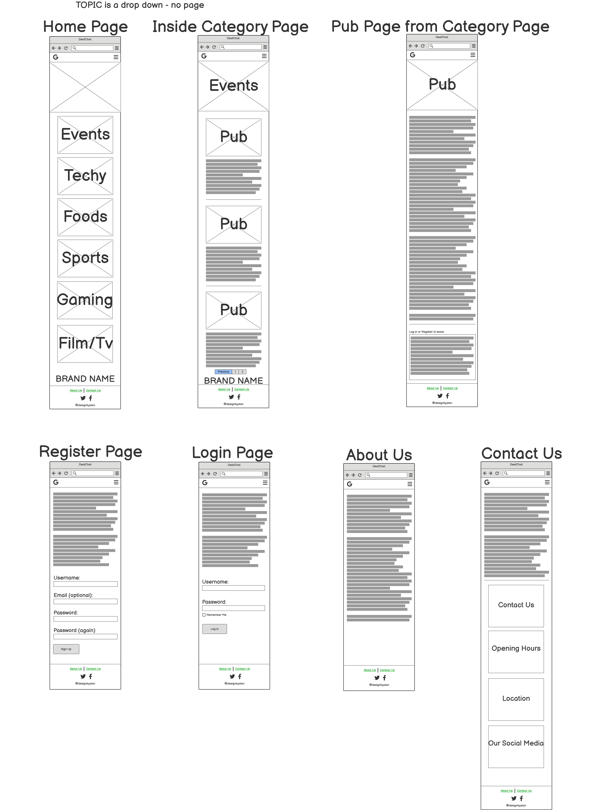
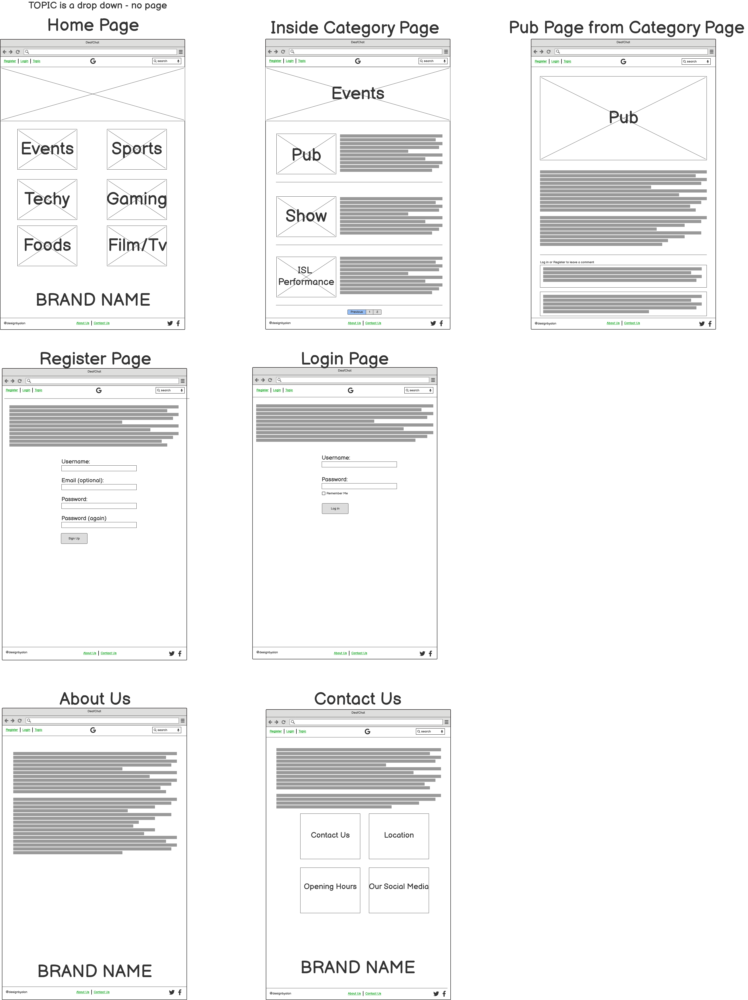
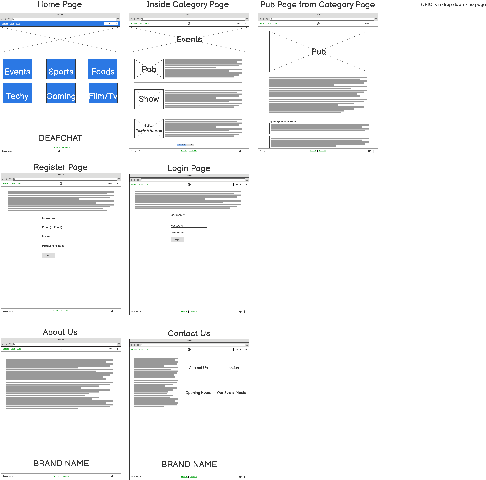
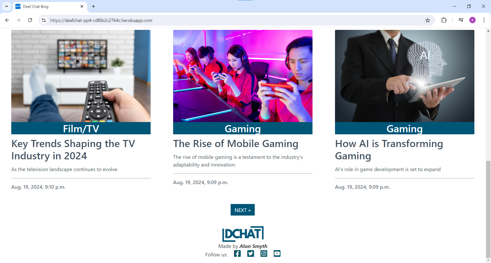
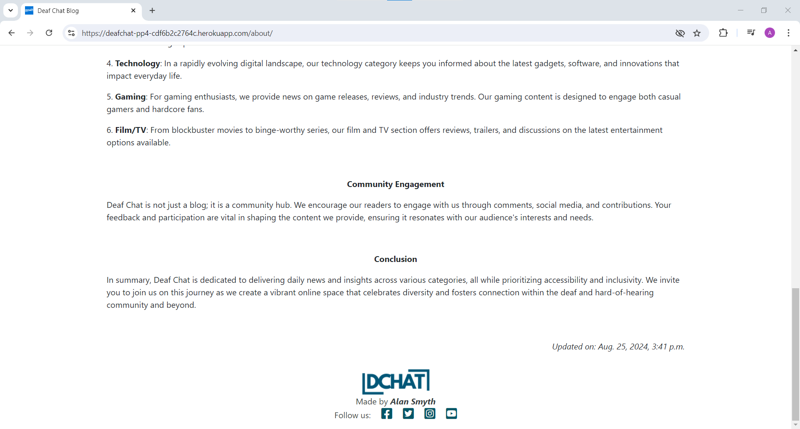

# [DEAFCHAT](https://deafchat-pp4-cdf6b2c2764c.herokuapp.com)

[](https://github.com/AlanSmythDeaf/deafchat/commits/main)
[](https://github.com/AlanSmythDeaf/deafchat/commits/main)
[](https://github.com/AlanSmythDeaf/deafchat)

At Deaf Chat is an innovative online platform designed to provide a comprehensive source of news and information tailored for a diverse audience. Our goal is to create an engaging space where users can explore daily updates across different categories. It's not just for Deaf people only. Blog aims is to try deliver news that is not only relevant but also inclusive. 
The goal is to have a place where the user don't need to have social media to read report and comments.

source: [amiresponsive](https://ui.dev/amiresponsive?url=https://deafchat-pp4-cdf6b2c2764c.herokuapp.com)

## UX

When decidind on the Project 4 - I had a look around at other people project and to see what fits me best, so I thought the blog was a good website to go with.
 - The first thing I need for the project to work was that need to follow the MVP as best I can
 - Chose the colour that is web accessbititly 
 - Using the User Story, Wireframe, Kaban that helps build the website.

### Colour Scheme 

I have chose the color blue as the main colour because,

The colour Blue is so significant to Deaf people, Deaf community and also is the colour of the Irish Deaf Society
Dark blue was chosen by the World Federation of the Deaf and Deaf associations around the World to represent Deafhood. That means an individual and collective journey to campaign against audism and a focus on the positivity of Deaf identities, including Sign Languages, Deaf Culture and Deaf History. 

My website is all about a blog for Deaf people so I have chosen blue for the main colour

I used [coolors.co](https://coolors.co/055677-ffffff-981f1f) to generate my colour palette.


### Typography

- [Segoe UI] was used for the primary headers and titles.

- [Font Awesome](https://fontawesome.com) icons were used throughout the site, such as the social media icons in the footer.

## User Stories

### New Site Users

- As a new site user, I would like to be able to navigate the page, so that I read many blogs.
- As a new site user, I would like to be able to sign up, so that I can comment on a post.
- As a new site user, I would like to be able to log out easily so that am confident that I have logged out.
- As a new site user, I would like to be able to navigate the contact easily, so that I can send message.

### Returning Site Users

- As a returning site user, I would like to log in without having to register, so that I can comment on the post.
- As a returning site user, I would like to read many blogs.

### Site Admin

- As a site administrator, I should be able to log in, so that I can access the admin page.
- As a site administrator, I should be able to delete or approve comment, so that I can control the page 
- As a site administrator, I should be able to manage the contact us, so that I can received message.

## Wireframes
- As I design the wireframe from the start, I had it in my head what I want to look like but as weeks went by when start on the PP4 coding, I couldnt follow the wireframe so made some changes to keep it simple and focus more on the coding.

### Mobile Wireframes
| 

### Tablet Wireframes
| 

### Desktop Wireframes
| 

## Features

### Existing Features
- **Home**

    - This is the first page when it's loaded, present the user with options to chose from in the navbar and topic to read a post.
      The page has 6 post per page and the user can click on next for more post
    1) Log in - to log in so that user can make a comment on a post
    2) Register - to be member so that user can make a comment on a post
    3) About - What the website is all about 
    4) Contact - for user to get in touch with the admin
    5) Topic Post - To read a post 

| Start|  |  
| --- | --- | 
|  |   |

- **About**

    - About page, this is learning what the website is all about, at the top you have video and scroll down you 
      will get text so the user have two options to either read or watch the video

| Start | End |  
| --- | --- | 
|  |  |

- **Contact**

    - Contact page, this is when a user want to get in touch with the admin. THe user must type in Name, Email Address and Message to be able to submit a message 
    
| Start | End |  
| --- | --- | 
|  |  |

- **Log In**

    - Log in page, this page is when a user log in to be able to make a comment on a post that they like, the user must type in username and password to be able to log in.
    
| Start | End |  
| --- | --- | 
|  |  |

- **Register**

    - Register page, this is where a person sign up to become a user to be able to make a comment and only need to log in when they return again. A person must enter a username and password twice to make sure the password is correct, the email is optional. No username can be the same.
    
| Start | End |  
| --- | --- | 
|  |  |

- **Post**

    - Post page, a user can read a post, doesn't need to be logged in to read a post but if wants to make a comment needs to log in.
    
| Start | End |  
| --- | --- | 
|  |  |


### Future Features
-  People/User to upload video on the contact us page so people can sign in their own sign language and also in the comment people can upload the video
- User to recieve notification that their comment is approve
- User to recieve notification that someone has comment on their commment section
- Site Admin to add a tick box if user want to get notification 
- Site Amin to add a video in each post so they can either read or watch the video in sign langauge
- Site Admin to add the category page so people can chose what topic they want to read.
- Site Admin to add a live streaming on odd occasion for certain post
- Add a search bar on the navigation bar
- Add reset a new password in login when a person forget a password

## Tools & Technologies Used

- [](https://tim.2bn.dev/markdown-builder) used to generate README and TESTING templates.
- [](https://git-scm.com) used for version control. (`git add`, `git commit`, `git push`)
- [](https://github.com) used for secure online code storage.
- [](https://gitpod.io) used as a cloud-based IDE for development.
- [](https://en.wikipedia.org/wiki/HTML) used for the main site content.
- [](https://en.wikipedia.org/wiki/CSS) used for the main site design and layout.
- [](https://www.javascript.com) used for user interaction on the site.
- [](https://www.python.org) used as the back-end programming language.

- [](https://pages.github.com) used for hosting the deployed front-end site.
- [](https://www.heroku.com) used for hosting the deployed back-end site.
- [](https://getbootstrap.com) used as the front-end CSS framework for modern responsiveness and pre-built components.
- [](https://www.djangoproject.com) used as the Python framework for the site.
- [](https://www.postgresql.org) used as the relational database management.
- [](https://cloudinary.com) used for online static file storage.
- [](https://whitenoise.readthedocs.io) used for serving static files with Heroku.
- [](https://balsamiq.com/wireframes) used for creating wireframes.
- [](https://www.canva.com/p/canvawireframes) used for creating images & erd
- [](https://fontawesome.com) used for the icons.
- [](https://chat.openai.com) used to help debug, troubleshoot, and explain things.
- [](https://copilot.microsoft.com/) used to help debug, troubleshoot, and explain things.

## Database Design

Entity Relationship Diagrams (ERD) help to visualize database architecture before creating models.
Understanding the relationships between different tables can save time later in the project.

```python
class Post(models.Model):
    title = models.CharField(max_length=200, unique=True)
    slug = models.SlugField(max_length=200, unique=True)
    author = models.ForeignKey(User, on_delete=models.CASCADE, related_name="blog_posts")
    featured_image = CloudinaryField('image', default='placeholder')
    content = models.TextField()
    created_on = models.DateTimeField(auto_now_add=True)
    status = models.IntegerField(choices=STATUS, default=0)
    excerpt = models.TextField(blank=True)
```
## Agile Development Process

### GitHub Projects

[GitHub Projects](https://github.com/AlanSmythDeaf/deafchat/projects) served as an Agile tool for this project.
It isn't a specialized tool, but with the right tags and project creation/issue assignments, it can be made to work.
Through it, user stories, issues, and milestone tasks were planned, then tracked on a weekly basis using the basic Kanban board.
screenshot Projects Board.

### GitHub Issues

[GitHub Issues](https://github.com/AlanSmythDeaf/deafchat/issues) served as an another Agile tool.
There, I used my own **User Story Template** to manage user stories.
It also helped with milestone iterations on a weekly basis.
screenshot of Open and Closed Issues.

## Testing

> [!NOTE]  
> For all testing, please refer to the [TESTING.md](TESTING.md) file.

## Deployment

The live deployed application can be found deployed on [Heroku](https://deafchat-pp4-cdf6b2c2764c.herokuapp.com).

### PostgreSQL Database

This project uses a [Code Institute PostgreSQL Database](https://dbs.ci-dbs.net).

To obtain my own Postgres Database from Code Institute, I followed these steps:

- Signed-in to the CI LMS using my email address.
- An email was sent to me with my new Postgres Database.

> [!CAUTION]  
> - PostgreSQL databases by Code Institute are only available to CI Students.
> - You must acquire your own PostgreSQL database through some other method
> if you plan to clone/fork this repository.
> - Code Institute students are allowed a maximum of 8 databases.
> - Databases are subject to deletion after 18 months.

### Cloudinary API

This project uses the [Cloudinary API](https://cloudinary.com) to store media assets online, due to the fact that Heroku doesn't persist this type of data.

To obtain your own Cloudinary API key, create an account and log in.

- For *Primary interest*, you can choose *Programmable Media for image and video API*.
- Optional: *edit your assigned cloud name to something more memorable*.
- On your Cloudinary Dashboard, you can copy your **API Environment Variable**.
- Be sure to remove the `CLOUDINARY_URL=` as part of the API **value**; this is the **key**.

### Heroku Deployment

This project uses [Heroku](https://www.heroku.com), a platform as a service (PaaS) that enables developers to build, run, and operate applications entirely in the cloud.

Deployment steps are as follows, after account setup:

- Select **New** in the top-right corner of your Heroku Dashboard, and select **Create new app** from the dropdown menu.
- Your app name must be unique, and then choose a region closest to you (EU or USA), and finally, select **Create App**.
- From the new app **Settings**, click **Reveal Config Vars**, and set your environment variables.

> [!IMPORTANT]  
> This is a sample only; you would replace the values with your own if cloning/forking my repository.

| Key | Value |
| --- | --- |
| `CLOUDINARY_URL` | user's own value |
| `DATABASE_URL` | user's own value |
| `DISABLE_COLLECTSTATIC` | 1 (*this is temporary, and can be removed for the final deployment*) |
| `SECRET_KEY` | user's own value |

Heroku needs three additional files in order to deploy properly.

- requirements.txt
- Procfile
- runtime.txt

You can install this project's **requirements** (where applicable) using:

- `pip3 install -r requirements.txt`

If you have your own packages that have been installed, then the requirements file needs updated using:

- `pip3 freeze --local > requirements.txt`

The **Procfile** can be created with the following command:

- `echo web: gunicorn app_name.wsgi > Procfile`
- *replace **app_name** with the name of your primary Django app name; the folder where settings.py is located*

The **runtime.txt** file needs to know which Python version you're using:
1. type: `python3 --version` in the terminal.
2. in the **runtime.txt** file, add your Python version:
	- `python-3.9.19`

For Heroku deployment, follow these steps to connect your own GitHub repository to the newly created app:

Either:

- Select **Automatic Deployment** from the Heroku app.

Or:

- In the Terminal/CLI, connect to Heroku using this command: `heroku login -i`
- Set the remote for Heroku: `heroku git:remote -a app_name` (replace *app_name* with your app name)
- After performing the standard Git `add`, `commit`, and `push` to GitHub, you can now type:
	- `git push heroku main`

The project should now be connected and deployed to Heroku!

### Local Deployment

This project can be cloned or forked in order to make a local copy on your own system.

For either method, you will need to install any applicable packages found within the *requirements.txt* file.

- `pip3 install -r requirements.txt`.

You will need to create a new file called `env.py` at the root-level,
and include the same environment variables listed above from the Heroku deployment steps.

> [!IMPORTANT]  
> This is a sample only; you would replace the values with your own if cloning/forking my repository.

Sample `env.py` file:

```python
import os

os.environ.setdefault("CLOUDINARY_URL", "user's own value")
os.environ.setdefault("DATABASE_URL", "user's own value")
os.environ.setdefault("SECRET_KEY", "user's own value")

# local environment only (do not include these in production/deployment!)
os.environ.setdefault("DEBUG", "True")
```

Once the project is cloned or forked, in order to run it locally, you'll need to follow these steps:

- Start the Django app: `python3 manage.py runserver`
- Stop the app once it's loaded: `CTRL+C` or `⌘+C` (Mac)
- Make any necessary migrations: `python3 manage.py makemigrations`
- Migrate the data to the database: `python3 manage.py migrate`
- Create a superuser: `python3 manage.py createsuperuser`
- Load fixtures (if applicable): `python3 manage.py loaddata file-name.json` (repeat for each file)
- Everything should be ready now, so run the Django app again: `python3 manage.py runserver`

#### Cloning

You can clone the repository by following these steps:

1. Go to the [GitHub repository](https://github.com/AlanSmythDeaf/deafchat) 
2. Locate the Code button above the list of files and click it 
3. Select if you prefer to clone using HTTPS, SSH, or GitHub CLI and click the copy button to copy the URL to your clipboard
4. Open Git Bash or Terminal
5. Change the current working directory to the one where you want the cloned directory
6. In your IDE Terminal, type the following command to clone my repository:
	- `git clone https://github.com/AlanSmythDeaf/deafchat.git`
7. Press Enter to create your local clone.

Alternatively, if using Gitpod, you can click below to create your own workspace using this repository.

[](https://gitpod.io/#https://github.com/AlanSmythDeaf/deafchat)

Please note that in order to directly open the project in Gitpod, you need to have the browser extension installed.
A tutorial on how to do that can be found [here](https://www.gitpod.io/docs/configure/user-settings/browser-extension).

#### Forking

By forking the GitHub Repository, we make a copy of the original repository on our GitHub account to view and/or make changes without affecting the original owner's repository.
You can fork this repository by using the following steps:

1. Log in to GitHub and locate the [GitHub Repository](https://github.com/AlanSmythDeaf/deafchat)
2. At the top of the Repository (not top of page) just above the "Settings" Button on the menu, locate the "Fork" Button.
3. Once clicked, you should now have a copy of the original repository in your own GitHub account!

### Local VS Deployment

There was no difference between local and deployment noticed

## Credits

### Content

| Source | Location | Notes |
| --- | --- | --- |
| [Markdown Builder](https://tim.2bn.dev/markdown-builder) | R |  |
| [W3Schools](https://www.w3schools.com/howto/howto_js_topnav_responsive.asp) |  |  |
| [YouTube](https://www.youtube.com/) |  |  |

### Media

| Source | Location | Type | Notes |
| --- | --- | --- | --- |
| [Canva](https://www.canva.com) | entire site | image | Post image |


### Acknowledgements

- I would like to thank my Code Institute mentor, [Tim Nelson](https://github.com/TravelTimN) for his support throughout the development of this project.
- I would like to thank the [Code Institute](https://codeinstitute.net) for the weekly meet up for guidance, advice and hsupport.
- I would like to thank the [Code Institute Slack community](https://code-institute-room.slack.com) for many differents ideas that have given me for the project and knowing that I am not alone for many different reason
- I would also like to thanks the Deaf people in the slack community

