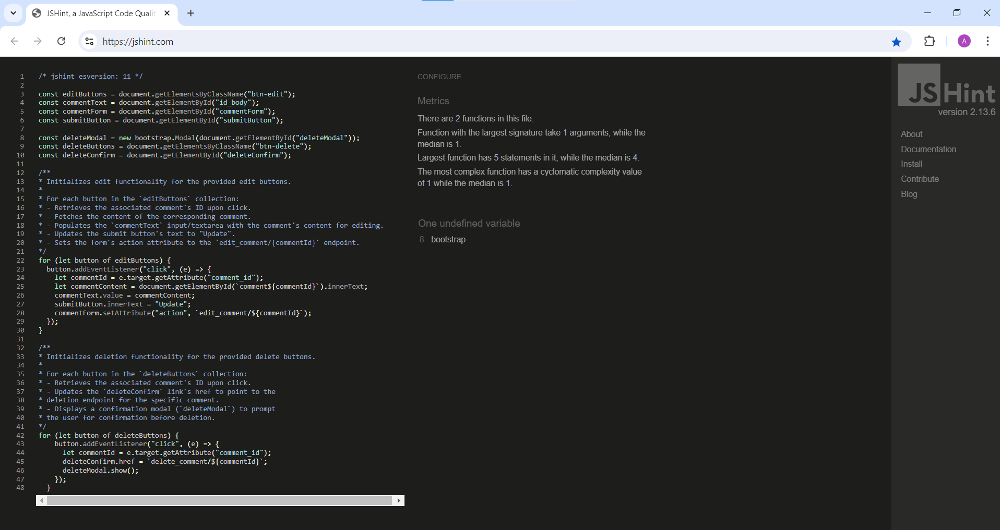
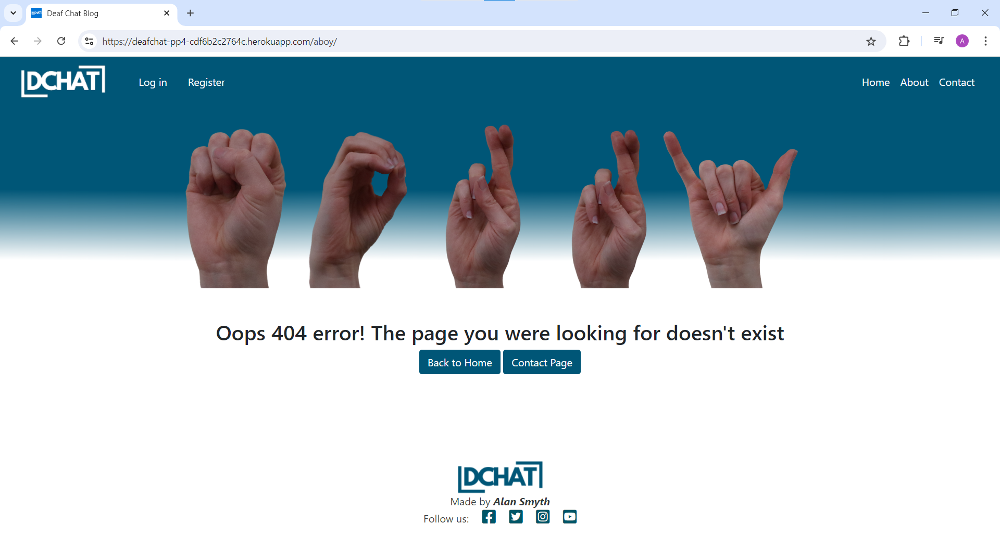
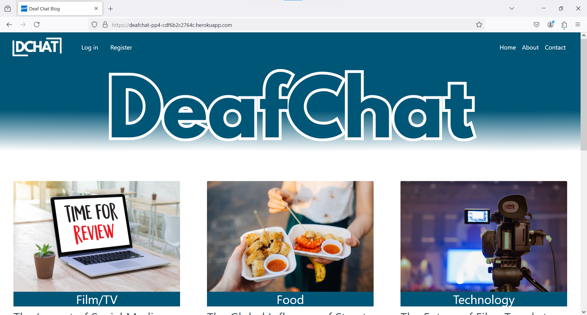
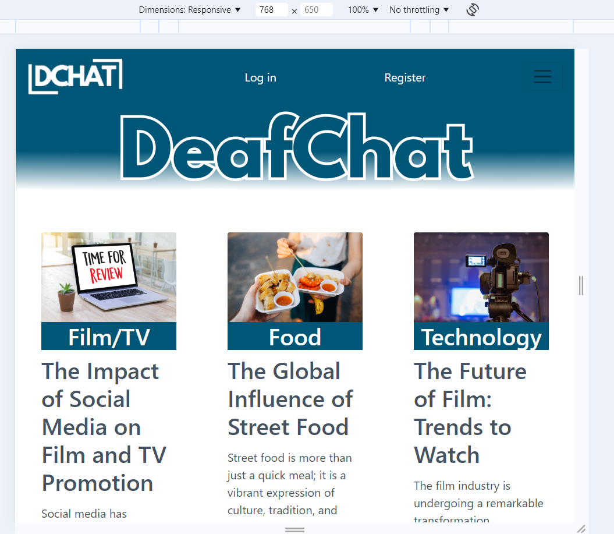
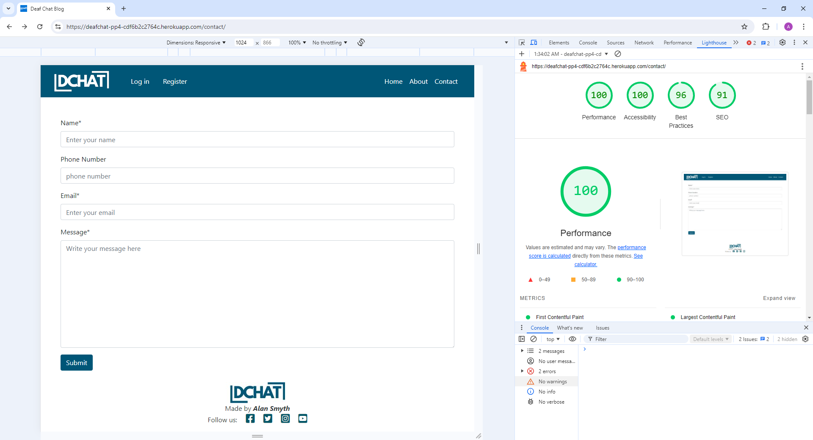
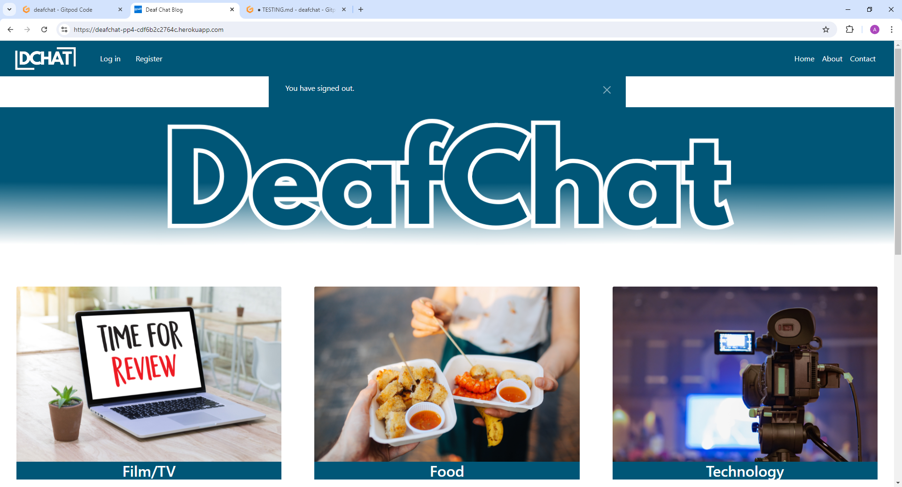
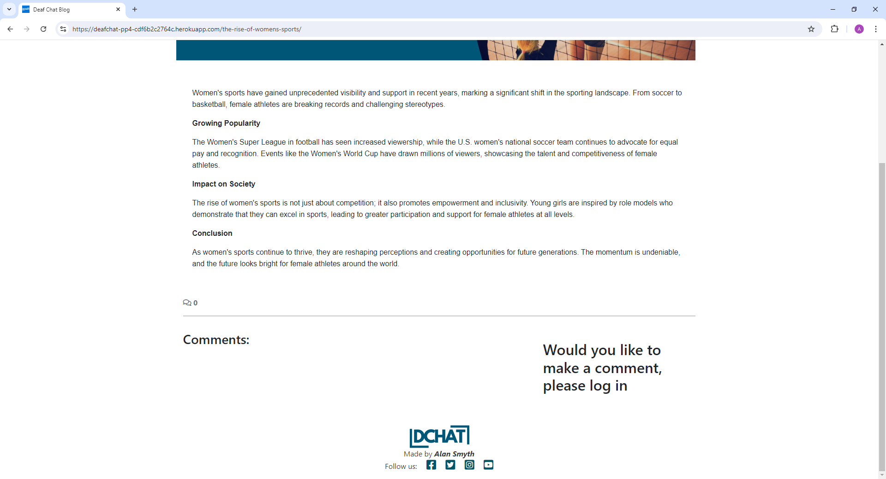
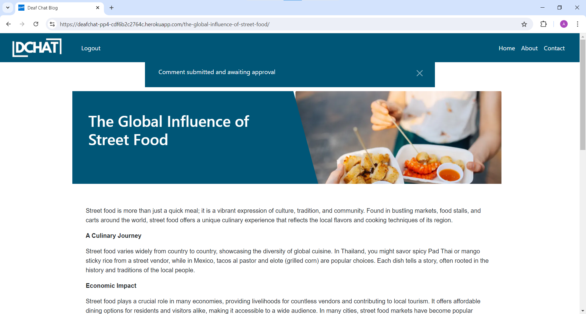

# Testing

> [!NOTE]  
> Return back to the [README.md](README.md) file.

## Code Validation

### HTML

I have used the recommended [HTML W3C Validator](https://validator.w3.org) to validate all of my HTML files.

| Directory | File | Screenshot | Notes |
| --- | --- | --- | --- |
| About | about.html |  | No error |
| Contact | contact.html |  | No error |
| Home | index.html |  | No error |
| Log In | contact.html |  | No error |
| Sign Up | contact.html |  | error due to template, couldnt fix it |
| Post | contact.html |  | error due to template, couldnt fix it |

### CSS

I have used the recommended [CSS Jigsaw Validator](https://jigsaw.w3.org/css-validator) to validate all of my CSS files.

| Directory | File | Screenshot | Notes |
| --- | --- | --- | --- |
| static | style.css |  | |

### JavaScript

I have used the recommended [JShint Validator](https://jshint.com) to validate all of my JS files.

| Directory | File | Screenshot | Notes |
| --- | --- | --- | --- |
| static | comments.js |  | |

### Python

I have used the recommended [PEP8 CI Python Linter](https://pep8ci.herokuapp.com) to validate all of my Python files.

| Directory | File | CI URL | Screenshot | Notes |
| --- | --- | --- | --- | --- |
| about | admin.py | [PEP8 CI](https://pep8ci.herokuapp.com/https://raw.githubusercontent.com/AlanSmythDeaf/deafchat/main/about/admin.py) |  | All clear, no errors found |
| about | models.py | [PEP8 CI](https://pep8ci.herokuapp.com/https://raw.githubusercontent.com/AlanSmythDeaf/deafchat/main/about/models.py) |  | All clear, no errors found |
| about | urls.py | [PEP8 CI](https://pep8ci.herokuapp.com/https://raw.githubusercontent.com/AlanSmythDeaf/deafchat/main/about/urls.py) |  | All clear, no errors found |
| about | views.py | [PEP8 CI](https://pep8ci.herokuapp.com/https://raw.githubusercontent.com/AlanSmythDeaf/deafchat/main/about/views.py) |  | All clear, no errors found |
| blog | admin.py | [PEP8 CI](https://pep8ci.herokuapp.com/https://raw.githubusercontent.com/AlanSmythDeaf/deafchat/main/blog/admin.py) |  | All clear, no errors found |
| blog | forms.py | [PEP8 CI](https://pep8ci.herokuapp.com/https://raw.githubusercontent.com/AlanSmythDeaf/deafchat/main/blog/forms.py) |  | All clear, no errors found |
| blog | models.py | [PEP8 CI](https://pep8ci.herokuapp.com/https://raw.githubusercontent.com/AlanSmythDeaf/deafchat/main/blog/models.py) |  | All clear, no errors found |
| blog | urls.py | [PEP8 CI](https://pep8ci.herokuapp.com/https://raw.githubusercontent.com/AlanSmythDeaf/deafchat/main/blog/urls.py) |  | All clear, no errors found |
| blog | views.py | [PEP8 CI](https://pep8ci.herokuapp.com/https://raw.githubusercontent.com/AlanSmythDeaf/deafchat/main/blog/views.py) |  | All clear, no errors found |
| chat | settings.py | [PEP8 CI](https://pep8ci.herokuapp.com/https://raw.githubusercontent.com/AlanSmythDeaf/deafchat/main/chat/settings.py) |  | line too long,line under-indented for visual indent, closing bracket does not match visual indentation |
| chat | urls.py | [PEP8 CI](https://pep8ci.herokuapp.com/https://raw.githubusercontent.com/AlanSmythDeaf/deafchat/main/chat/urls.py) |  | All clear, no errors found |
| chat | views.py | [PEP8 CI](https://pep8ci.herokuapp.com/https://raw.githubusercontent.com/AlanSmythDeaf/deafchat/main/chat/views.py) |  | All clear, no errors found |
| contact | admin.py | [PEP8 CI](https://pep8ci.herokuapp.com/https://raw.githubusercontent.com/AlanSmythDeaf/deafchat/main/contact/admin.py) |  | All clear, no errors found |
| contact | forms.py | [PEP8 CI](https://pep8ci.herokuapp.com/https://raw.githubusercontent.com/AlanSmythDeaf/deafchat/main/contact/forms.py) |  | All clear, no errors found |
| contact | models.py | [PEP8 CI](https://pep8ci.herokuapp.com/https://raw.githubusercontent.com/AlanSmythDeaf/deafchat/main/contact/models.py) |  | All clear, no errors found |
| contact | urls.py | [PEP8 CI](https://pep8ci.herokuapp.com/https://raw.githubusercontent.com/AlanSmythDeaf/deafchat/main/contact/urls.py) |  | All clear, no errors found |
| contact | views.py | [PEP8 CI](https://pep8ci.herokuapp.com/https://raw.githubusercontent.com/AlanSmythDeaf/deafchat/main/contact/views.py) |  | All clear, no errors found |
| DEAFCHAT | manage.py | [PEP8 CI](https://pep8ci.herokuapp.com/https://raw.githubusercontent.com/AlanSmythDeaf/deafchat/main/manage.py) |  | All clear, no errors found |

## Browser Compatibility

I've tested my deployed project on three browsers to check for compatibility issues.
- [Chrome](https://www.google.com/chrome)
- [Firefox](https://www.mozilla.org/firefox)
- [Edge](https://www.microsoft.com/edge)

| Browser |  |  |  | | Notes |
| --- | --- | --- | --- | --- | --- |
| Chrome | Home  | About  | Contact  | Log in  | |
| Chrome | Register  | Post  | 404 page  |  | Works as expected |
| Firefox | Home  | About  | Contact  | Log in  | |
| Firefox | Register  | Post  | 404 page  |  | Works as expected |
| Edge | Home  | About  | Contact  | Log in  | |
| Edge | Register  | Post  | 404 page  |  | Works as expected |

## Responsiveness

I've tested my deployed project on multiple devices to check for responsiveness issues.
- Mobile
- Tablet
- Desktop

| Device | Home | About | Contact | log in | Register | Post | Notes |
| --- | --- | --- | --- | --- | --- | --- | --- |
| Mobile (DevTools) |  |  |  |  |  |  | works as expected | 
| Tablet (DevTools) |  |  |  |  |  |  | works as expected | 
| Desktop |  |  |  |  |  |  | works as expected | 

## Lighthouse Audit

I've tested my deployed project using the Lighthouse Audit tool to check for any major issues.

| Page | Mobile | Desktop | Notes |
| --- | --- | --- | --- |
| Home |  |  | Some minor warnings |
| About |  |  | Some minor warnings |
| Contact |  |  |  |
| Log in |  |  |  |
| Register |  |  |  |
| Post |  |  |  |

## Defensive Programming

Defensive programming was manually tested with the below user acceptance testing:

| Page | Expectation | Test | Result | Fix | Screenshot |
| --- | --- | --- | --- | --- | --- |
| Log in | | | | | |
| | The log in page is about user logging into their account, User should be able to log in by adding username and password. | Test the log in by logging in without username or password and clicking submit button | The feature behaved as expected and lanad the user to the index page | Test concluded and passed | - |
| | ScreenShot |  |  |  | - |

| Page | Expectation | Test | Result | Fix | Screenshot |
| --- | --- | --- | --- | --- | --- |
| Register (Sign up) | | | | | |
| | The sign up page is about user to register with the website to be able to log in | Test the sign up button by logging in without username or password to see if can bypass it without username or passwoed | The feature behaved as expected as cannot have same username and need to insert a password to be able register | Test concluded and passed | - |
| | ScreenShot |  |  |  | - |

| Page | Expectation | Test | Result | Fix | Screenshot |
| --- | --- | --- | --- | --- | --- |
| Logged Out | | | | | |
| | Log out is in the top of the navbar when the user is logged in so able to logged when the user want to | Tested the feature by logging out | The feature behaved as expected as display a warning and letting user know logged out | Test concluded and passed | - |
| | Screenshot |  |  | - |

| Page | Expectation | Test | Result | Fix | Screenshot |
| --- | --- | --- | --- | --- | --- |
| Contact | | | | | |
| | The contact is about the user getting in touch with the admin but using the form and able to submit a button with notification| Test the form with not putting everything that you need to it that has an asterix  | The feature behaved as expected and force the user to make sure that the form is filled in with asterix | Test concluded and passed | - |
| | ScreenShot |  |  |  | - |
| | ScreenShot |  |  | - | - |

| Page | Expectation | Test | Result | Fix | Screenshot |
| --- | --- | --- | --- | --- | --- |
| Comment | | | | | |
| | This is when a user would like to make a comment and edit own and deleting comment | Tested the feature try to comment without being a user and being a user | The feature behaved as expected | Test concluded and passed | - |
| | Screenshot |  |  |  |  |
## User Story Testing

| User Story | Screenshot |
| --- | --- |
| As a new site user, I would like to be able to navigate the page, so that I read the blog. |  |
| As a new site user, I would like to be able to sign up, so that I can comment on a post. |  |
| As a new site user, I would like to be able to log out easily so that am confident that I have logged out. |  |
| As a new site user, I would like to be able to navigate the contact easily, so that I can send message.|  |

| User Story | Screenshot |
| --- | --- |
| As a site administrator, I should be able to log in, so that I can access the admin page |  |
| As a site administrator, I should be able to delete or approve comment, so that I can control the page |  |
| As a site administrator, I should be able to manage the contact us, so that I can received message. |  |

## Bugs

### GitHub **Issues**

**Open Issues**

Any remaining open issues can be tracked [here](https://github.com/AlanSmythDeaf/deafchat/issues).

## Unfixed Bugs

- Html Validation

    

    - Couldnt find it to fix it but came clear it was signup template so I couldnt change it

- Python

    

    - Most of the line are too long, with others I have no issue solving it but I felt that i should leave it as it's because it's a setting.

- JS

    

    - I couldnt figure it out as it was working

> [!NOTE]  
> There are no remaining bugs that I am aware of.
